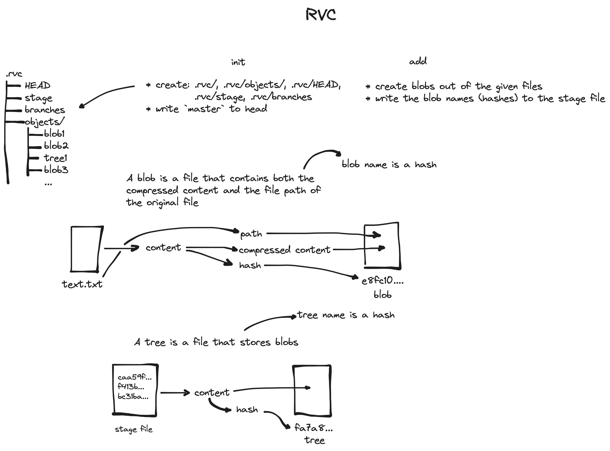

# Introduction

**RVC** is a version control system.

# Dependecies

Ensure that these libraries are downloaded and accessible:

> * OpenSS
> * ZLIB

The source code of these libraries can be downloaded into `third_party/`

# Build

From the root directory execute:

```
cmake -B build/
make -C build/
```

The executable will be generated in `bin/`

# Usage

```
rvc init
rvc add CMakeFile.txt README.md
rvc commit
```

# Implementation

**File structure:**
* .rvc/
	* HEAD
	* stage
	* branches
	* objects/
		* object_hash...
		* object_hash...
		* object_hash...

**File structure explanation:**
* `.rvc/`: the root directory for `RVC` in the working directory
* `HEAD`: contains the current commit or branch name
* `stage`: contains the blob names that are generated from the provided with `rvc add`
* `branches`: stores branch names and their last hashes
	- File format: `branch_name1\0commit_hash1\0branch_name2\0commit_hash2\0`
	- When there is no commits the first commit hash is just 32 `0`s
* `objects/`: stores all blob and tree objects

Objects inside the `objects/` directory are files that serve different purposes.

**Objects:**
* blob: stores compressed data and path
* tree: stores list of blobs
* commit: commit hash, prev commit hash, tree hash, author, email, branch, message, date: dd:mm:YY hh:mm:ss
	- commit hash is a mixture of all information listed above

**Commands:**
* init: creates file structure
* add: craetes blobs out of added files and add it to the stage file
* commit: craetes a commit out of the stage file
* *switch: switch to another branch (coming soon)*
* *status: prints info about the current project status (coming soon)*
* *gc: deletes unnecessary objects (coming soon)*
* *log: prints out the history of changes (coming soon)*

# Diagram



# License

This project is licensed under the MIT License. See the [LICENSE](LICENSE) file for details.
